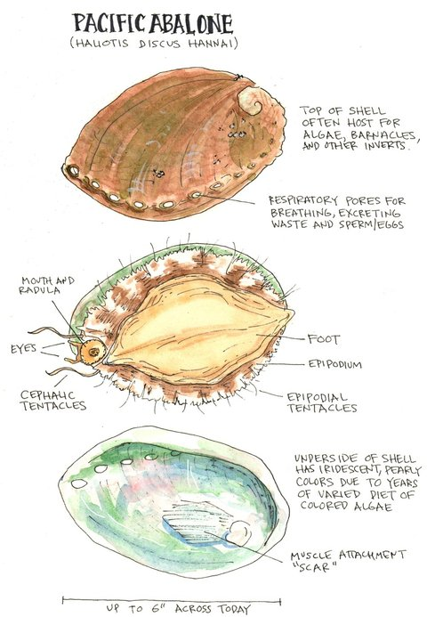
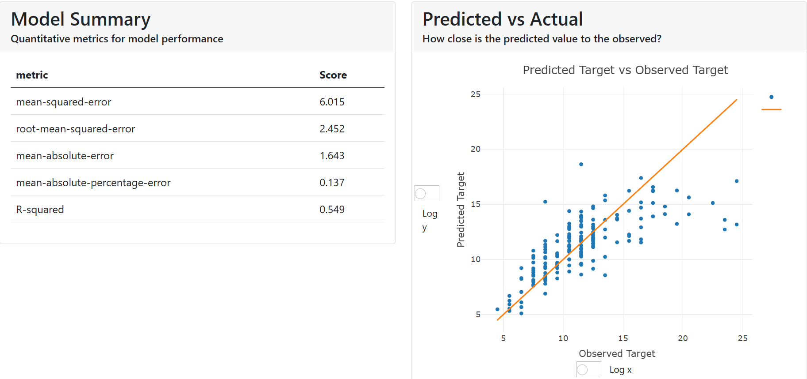

# Abalone Age Prediction

Student bootcamp capstone from an **EDA and dev tools** course. This repository predicts abalone age from physical measurements using a sklearn pipeline, cross-validated model selection, bootstrap uncertainty intervals, and an interactive model dashboard.

## About abalones

Abalones are marine gastropod molluscs (family Haliotidae) that live in coastal seawater. They typically grow to 10-25 cm and have a flat, spiral shell on top and a large muscular foot underneath used for movement and feeding. The shell has small holes along its edge and an iridescent inner layer (mother of pearl) used in buttons, trinkets, and jewellery.

*Text adapted from [ASC - Farmed abalone](https://asc-aqua.org/learn-about-seafood-farming/farmed-abalone/).*



*Image: [Sea History for Kids - Abalone](https://seahistory.org/sea-history-for-kids/abalone/).*

## Problem and dataset

**Task:** predict abalone age from physical measurements.

In practice, age is estimated by cutting the shell, staining it, and counting rings under a microscope - a slow, labour-intensive process. Easier-to-measure size and weight variables are used as predictors instead. Weather, location, and food availability may also influence growth, but are not included in this dataset.

In the original UCI release, rows with missing values were removed (mostly missing targets), and continuous features were scaled for neural-network experiments (divided by 200). This project uses the raw measurements with preprocessing inside a sklearn `Pipeline`.

**Target:** age in years, computed as `Rings + 1.5`.

**Source:** [UCI Machine Learning Repository - Abalone](https://archive.ics.uci.edu/dataset/1/abalone)

## Approach

1. **EDA** - distributions, correlations, data-quality notes (`reports/`)
2. **Preprocessing** - one-hot encoding and scaling inside a sklearn `Pipeline` (fitted on train data only)
3. **Model selection** - 5-fold CV comparing Ridge, HistGradientBoosting, RandomForest
4. **Evaluation** - hold-out test metrics and bootstrap 95% CI for RMSE
5. **Interpretability** - [ExplainerDashboard](https://github.com/oegedijk/explainerdashboard) (SHAP, what-if, contributions)

## Key findings

### Data (EDA)

- **4,177** abalones with **8** morphology/weight predictors; age spans **2.5–30.5 years** (mean **11.4**, std **3.2**).
- **Shell weight** is the strongest correlate with age (r ≈ **0.62**), followed by **diameter**, **height**, and **length** (r ≈ **0.56**). Weight features show moderate positive correlation (r ≈ **0.42–0.53**).
- **Infants** (`Sex = I`) are younger on average (median age **9.5** vs **11.5** for M/F).
- Light cleaning only: `f` → `F` in `Sex`, median imputation for rare missing values, zero `Height` replaced - see `reports/eda_summary.md` and `reports/figures/`.

### Modelling

- **Random Forest** wins 5-fold CV (RMSE **2.17 ± 0.10**) over HistGradientBoosting (**2.18 ± 0.11**) and Ridge (**2.28 ± 0.14**).
- On the hold-out test set: RMSE **2.28**, MAE **1.61**, R² **0.52**. Bootstrap 95% CI for RMSE: **[2.10, 2.45]** (see `artifacts/metrics.json`).
- Residuals are near zero on average (mean **−0.06**), but individual errors can be large (up to ~**11 years**), which is expected given measurement noise and skewed features.
- Results match common benchmarks on this dataset (RMSE ≈ **2.2–2.3**, R² ≈ **0.52–0.55**).

### Interpretability (dashboard)

- SHAP and feature-importance views highlight **shell weight** and **size measures** (diameter, length) as the main drivers - aligned with EDA correlations.
- Dependence plots show **non-linear** effects (especially for weight features), which supports tree-based models over a linear baseline.
- **What-if** and **contribution** tabs show how changing measurements shifts predicted age.



**Note:** Model Summary stats in the dashboard (e.g. R² ≈ 0.55) are computed on a **200-row sample** from the test set (for faster SHAP). Reported results in this README and `artifacts/metrics.json` use the **full hold-out test set** (836 rows; R² ≈ 0.52). Both use the same model and test split.

## Results

Hold-out test set (20%, `random_state=42`). Selected model: **Random Forest** (lowest 5-fold CV RMSE).

| Model | CV RMSE (mean ± std) |
|-------|----------------------|
| Ridge | 2.28 ± 0.14 |
| HistGradientBoosting | 2.18 ± 0.11 |
| **Random Forest** | **2.17 ± 0.10** |

**Test set (Random Forest pipeline):**

| Metric | Value |
|--------|-------|
| RMSE | 2.28 |
| MAE | 1.61 |
| R² | 0.52 |
| RMSE 95% CI (bootstrap) | [2.10, 2.45] |

Full details in `artifacts/metrics.json`. Diagnostic plots in `reports/figures/`.

## Transferable skills

- End-to-end ML workflow with a fixed train/test split and preprocessing in one `Pipeline`
- Model comparison with cross-validation and bootstrap confidence intervals
- Linting and automated tests in GitHub Actions
- Dashboard packaged for local use and Docker

## Technology stack

| Tool | Role in this project |
|------|----------------------|
| **Python 3.10+** | Runtime for training, evaluation, and serving |
| **pandas / NumPy** | Load, clean, and split the dataset |
| **scikit-learn** | `Pipeline` (preprocessing + model), cross-validation, regression models |
| **joblib** | Save and load the trained pipeline (`artifacts/model.joblib`) |
| **matplotlib / seaborn** | EDA and diagnostic plots (`reports/figures/`) |
| **SHAP** | Feature effects inside the dashboard (via ExplainerDashboard) |
| **ExplainerDashboard** | Interactive regression dashboard (SHAP, what-if, contributions) |
| **Dash / Flask** | Web UI for the dashboard (used by ExplainerDashboard) |
| **Waitress** | Production-style HTTP server for `abalone serve` |
| **Docker** | Run the dashboard in a container with pinned dependencies |
| **pytest** | Unit tests (`tests/`) |
| **Ruff** | Linting and style checks |
| **GitHub Actions** | CI: Ruff and pytest on Python 3.10 and 3.12 |

CLI entry points are implemented with **argparse** (`abalone train`, `evaluate`, `serve`, etc.).

## Project structure

```
src/abalone/     Python package (data, train, evaluate, EDA, dashboard, CLI)
tests/           Unit tests (no network required)
artifacts/       Model, metrics, dashboard config (committed for demo)
reports/         EDA figures and summary
docs/            README figures (anatomy, dashboard screenshot)
notebooks/       EDA notebook
```

## Development

```bash
pip install -e ".[dev]"
ruff check src tests
pytest
```

CI runs Ruff + pytest on Python 3.10 and 3.12 (see `.github/workflows/ci.yml`).

## How to run

### Prerequisites

- Python **3.10+**
- Git
- Optional: Docker (or WSL on Windows) for the containerised dashboard

### 1. Clone and install

```bash
git clone https://github.com/m-logviniuk/eda_and_dev_tools.git
cd eda_and_dev_tools

python -m venv .venv
source .venv/bin/activate          # Windows: .venv\Scripts\activate

pip install -e ".[dev]"            # development install with pytest and ruff
# pip install -e .                 # runtime only
```

### 2. Quick demo (pre-trained model)

Uses committed `artifacts/model.joblib` - no training required.

```bash
abalone serve
```

Open **http://localhost:9050**. First startup rebuilds the explainer (~30 s; needs network to download the dataset for the test split).

### 3. Verify model loads and predicts

After `pip install -e .`, confirm the saved pipeline predicts on the hold-out test set:

```bash
abalone evaluate
```

Or as a one-liner smoke test:

```bash
python -c "import numpy as np; import joblib; from abalone.data import get_train_test_split; from abalone.config import MODEL_PATH; pipe = joblib.load(MODEL_PATH); _, X_test, _, y_test = get_train_test_split(); pred = pipe.predict(X_test); rmse = float(np.sqrt(np.mean((pred - y_test)**2))); print(f'Model OK, preds: {len(pred)}, RMSE: {rmse:.3f}')"
```

Expected: `Model OK, preds: 836, RMSE: 2.278` (may vary slightly after retraining).

### 4. Full pipeline (train from scratch)

```bash
abalone pipeline                   # train → evaluate → EDA → build-dashboard
# abalone train && abalone evaluate && abalone eda && abalone build-dashboard
```

Outputs: `artifacts/model.joblib`, `artifacts/metrics.json`, `reports/figures/`.

### 5. Docker

Pre-trained artifacts are served by default (no training at build time).

```bash
docker build -t abalone-dashboard .
docker run --rm -p 9050:9050 abalone-dashboard
```

First build usually takes **~10 min** (downloads numpy, scipy, scikit-learn, SHAP, Dash, etc.). Use `docker build` without `--no-cache` on repeat builds so dependency layers are reused (~seconds if only code/artifacts changed). `--no-cache` forces a full reinstall and is mainly for debugging dependency pins.

On Windows without Docker Desktop, use **WSL** from the cloned repo directory:

```bash
cd /mnt/c/<path-to>/eda_and_dev_tools   # e.g. /mnt/c/Users/<you>/projects/eda_and_dev_tools
# or, if cloned inside WSL: cd ~/eda_and_dev_tools

docker build -t abalone-dashboard .
docker run --rm -p 9050:9050 abalone-dashboard
```

The image uses `requirements-docker.txt` (serve-only deps, no matplotlib/seaborn), sets `ABALONE_PROJECT_ROOT=/app`, and pins `scikit-learn==1.4.1.post1` and `dash-bootstrap-components==1.5.0`.

### 6. Google Colab

```python
!pip install git+https://github.com/m-logviniuk/eda_and_dev_tools.git

from abalone.train import train_and_select_model
from abalone.evaluate import run_evaluation
from abalone.eda_report import generate_eda_report

train_and_select_model()
run_evaluation()
generate_eda_report()
```

See `notebooks/eda.ipynb` for an interactive walkthrough.

## License

MIT - see [LICENSE](LICENSE).